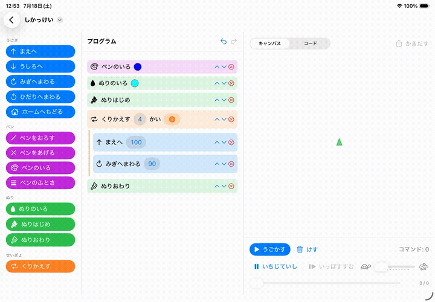

# TortoiseBlocks

[](https://swift.org)
[](LICENSE)
[]()

A visual programming app for kids — snap blocks together, press Run, and
watch the tortoise draw. Powered by
[TortoiseGraphics2](https://github.com/temoki/TortoiseGraphics2), a turtle
graphics engine written in Swift.

<p align="center">
  
</p>

## Features

- **Block editor** — tap or drag & drop blocks (motion / pen / fill /
  repeat), nest repeats, edit arguments in place, reorder freely, undo
- **Dice values 🎲** — any number slot can roll a random value on every run,
  so the same program draws a different picture each time
- **Live playback** — pause, single-step, seek with a scrubber, and change
  speed mid-run; the executing block stays highlighted in the workspace so
  kids can see exactly which block draws which line
- **Blocks → Swift** — a code pane shows the equivalent
  [Tortoise API](https://github.com/temoki/TortoiseGraphics2) program, as a
  bridge from blocks to text programming
- **Documents** — a standard document app: `.tortoiseblocks` files (JSON),
  iCloud Drive / Files integration, autosave, system undo
- **Export** — SVG (vector, straight from the library) and PNG
- **English / Japanese** — Japanese uses kid-friendly hiragana; adding a
  language is a single string-catalog edit

## Requirements

- **Xcode** 26+ (Swift 6.2)
- **Platforms** iOS / iPadOS 26+ · macOS 26+ (visionOS planned)

## Getting Started

```bash
git clone https://github.com/temoki/TortoiseBlocks
open TortoiseBlocks/TortoiseBlocks.xcodeproj   # select a destination and Run
```

The logic layer is an independent SwiftPM package with its own test suite:

```bash
cd TortoiseBlocks/TortoiseBlocksKit
swift test
```

## Architecture

```
TortoiseBlocks/
├── TortoiseBlocksKit/   # UI-independent SwiftPM package (depends on TortoiseCore only)
│   ├── Model/           #   Block tree, frozen JSON format, pure editing functions
│   ├── Engine/          #   BlockExpander: block tree → command stream (+ blockID tags)
│   └── CodeGen/         #   SwiftCodeGenerator: block tree → Swift source
└── App/                 # SwiftUI document app (palette | workspace | canvas)
```

The runtime pipeline is one straight line:

```
[Block] ──BlockExpander──▶ [ExpandedCommand] ──▶ Tortoise.apply ──▶ TortoiseCanvas(_:player:)
   │                              │
   └─SwiftCodeGenerator──▶ code pane            └─ blockID ──▶ executing-block highlight
```

Randomness is resolved at expansion time and the evaluated command stream is
kept, so exports always render exactly what is on screen.

## File Format

A `.tortoiseblocks` document is JSON with an explicit, frozen wire format
(hand-written coding keys, pinned by snapshot tests — renaming Swift
identifiers can never break saved files):

```json
{
  "schemaVersion" : 1,
  "title" : "Random Star",
  "blocks" : [
    { "id" : "…", "kind" : { "penColor" : "purple" } },
    { "id" : "…", "kind" : { "repeat" : {
        "count" : { "literal" : 36 },
        "body" : [
          { "id" : "…", "kind" : { "forward" : { "random" : { "min" : 100, "max" : 200 } } } },
          { "id" : "…", "kind" : { "turnRight" : { "literal" : 170 } } }
        ] } } }
  ]
}
```

## Roadmap

Remaining work is tracked in
[GitHub Issues](https://github.com/temoki/TortoiseBlocks/issues): the
[M7 milestone](https://github.com/temoki/TortoiseBlocks/milestone/1) covers
polish toward a TestFlight release (accessibility audit, iPhone layout,
macOS menus, App Store preparation), and the
[Future milestone](https://github.com/temoki/TortoiseBlocks/milestone/2)
collects ideas beyond it — visionOS, if-blocks and variables, a template
gallery, more languages.

## License

[MIT](LICENSE)
