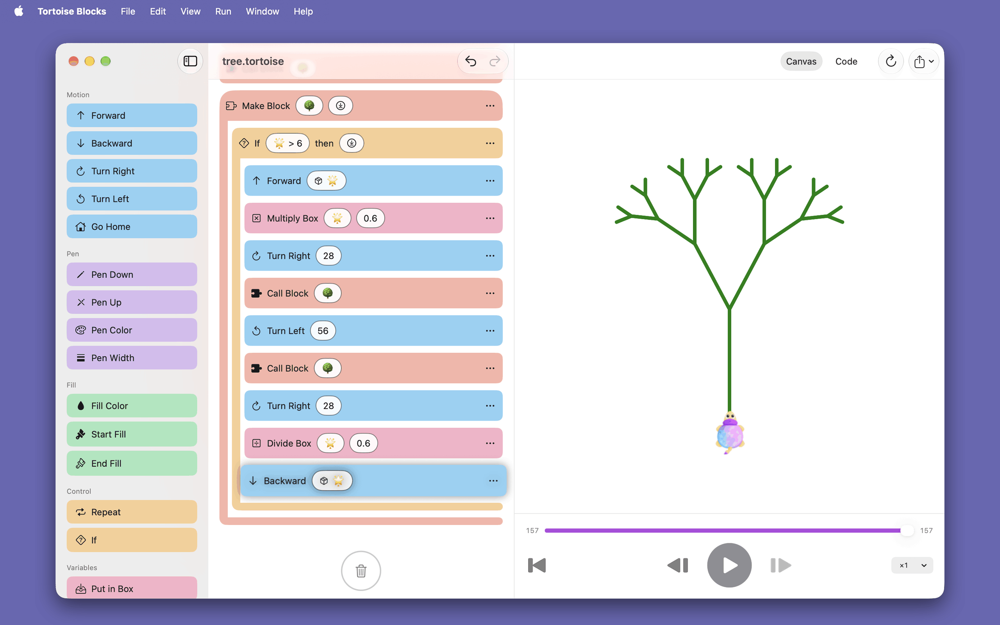
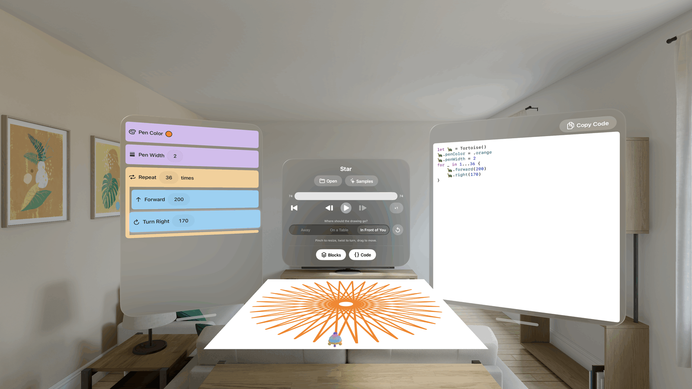

  

# Tortoise Blocks

[](https://swift.org)
[](LICENSE)
[]()

A visual programming app for kids — snap blocks together, press play, and
watch the tortoise draw. Powered by
[TortoiseGraphics2](https://github.com/temoki/TortoiseGraphics2), a turtle
graphics engine written in Swift.

[**Website**](https://temoki.github.io/TortoiseBlocks/) ·
[**App Store**](https://apps.apple.com/app/id6798677334) ·
[Privacy](https://temoki.github.io/TortoiseBlocks/privacy.html)



## Features

- **Block editor** — tap or drag & drop blocks (movement / pen / fill /
  control / boxes / my blocks), nest them, edit arguments in place, and reach
  every row operation from one ⋯ menu; drop a block on the trash to throw it
  away or tap the trash to clear the program, and undo everything
- **Repeat, if, and boxes** — loop a body, branch on a comparison
  (with an optional else), and keep a value in a named box 🌟 you can set
  and do arithmetic on — enough to write a program that grows as it draws
- **My blocks 🌳** — name a block, put anything inside it, and call it by name
  from anywhere; a definition is *the mention*, so an undefined call is a no-op
  rather than a broken reference, and the first definition of a name wins.
  Calls are spliced in where they stand, which makes recursion fall out for
  free — a block that calls itself twice is a fractal tree, and one of the
  samples is exactly that
- **Dice 🎲** — any number *or color* slot can roll a random value on every
  run, so the same program draws a different picture each time
- **Live playback** — a video-style transport: play, pause, step one command
  at a time, seek with a scrubber, change speed mid-run; the executing block
  stays highlighted in the workspace so kids can see exactly which block
  draws which line
- **Blocks → Swift** — a syntax-colored code pane shows the equivalent
  [Tortoise API](https://github.com/temoki/TortoiseGraphics2) program, as a
  bridge from blocks to text programming
- **A viewer on Apple Vision Pro** — drawings are made on iPad and Mac; open
  one on Vision Pro and it lies on a real table in front of you, at whatever
  size you like, with a 3D tortoise standing on the paper walking the line as
  it appears. The blocks and the generated Swift open in windows either side of
  it, so a headset never has to choose between them the way one screen does
- **Documents** — a standard document app: `.tortoise` files (JSON),
  iCloud Drive / Files integration, its own folder under On My iPad, autosave,
  system undo; a new document can start from a sample program
- **Thumbnails in Finder & Files** — a QuickLook extension draws each
  document's last picture, so the app's own folder reads as a gallery of
  drawings instead of a row of identical icons
- **Export & share** — SVG (vector, straight from the library) and PNG at
  1x / 2x / 3x, on a transparent ground so a drawing drops onto anything,
  saved to a file or sent through the share sheet
- **English / Japanese** — Japanese uses kid-friendly hiragana; adding a
  language is a single string-catalog edit



## Requirements

- **Xcode** 26+ (Swift 6.2)
- **Platforms** iPadOS 26+ · macOS 26+ · visionOS 26+ — the three-pane editor
  on iPad and Mac, and on Vision Pro a viewer for what they made, with no
  editing in it at all

## Getting Started

```bash
git clone https://github.com/temoki/TortoiseBlocks
open TortoiseBlocks/TortoiseBlocks.xcodeproj   # select a destination and Run
```

The logic layer is an independent SwiftPM package with its own test suite:

```bash
cd TortoiseBlocks/TortoiseBlocksKit
swift test
```

## Architecture

```
TortoiseBlocks/
├── TortoiseBlocksKit/     # UI-independent SwiftPM package (depends on TortoiseCore only)
│   ├── Model/             #   Block tree, frozen JSON format, pure editing functions
│   ├── Engine/            #   BlockExpander: block tree → command stream (+ blockID tags)
│   └── CodeGen/           #   SwiftCodeGenerator: block tree → Swift source (+ tokenizer)
├── App/                   # SwiftUI document app (palette | workspace | canvas)
│   └── Views/Viewer/      #   visionOS only: the drawing on the table, and its three windows
├── ThumbnailExtension/    # QuickLook thumbnails — reads one field, links nothing
├── TortoiseBlocksUITests/ # Not a test suite so much as a camera: it shoots the captures
├── Tools/                 # The capture rigs, and the Blender script the 3D tortoise comes from
├── appstore/              # The store listing: text per locale, screenshots per platform
├── fastlane/              # Pushes appstore/ to App Store Connect
└── site/                  # The published website (GitHub Pages); docs/ is not published
```

The runtime pipeline is one straight line:

```
[Block] ──BlockExpander──▶ [ExpandedCommand] ──▶ Tortoise.apply ──▶ TortoiseCanvas(_:player:)
   │                              │
   └─SwiftCodeGenerator──▶ code pane            └─ blockID ──▶ executing-block highlight
```

Randomness is resolved at expansion time and the evaluated command stream is
kept, so an export always renders the drawing that actually ran, dice and
all. It is not a screenshot of the canvas pane, though: exports crop tight to
the drawing and leave the tortoise cursor out.

The QuickLook extension sits outside that pipeline entirely. It links no
package: it reads the document, lifts one base64 field out of the JSON, and
draws it — which is why a file written by a future version, or one holding a
block kind it has never heard of, still gets a thumbnail.

## File Format

A `.tortoise` document is JSON with an explicit, frozen wire format
(hand-written coding keys, pinned by snapshot tests — renaming Swift
identifiers can never break saved files):

```json
{
  "blocks" : [
    { "id" : "…", "kind" : { "penColor" : "purple" } },
    { "id" : "…", "kind" : { "repeat" : {
        "count" : { "literal" : 36 },
        "body" : [
          { "id" : "…", "kind" : { "forward" : { "random" : { "min" : 100, "max" : 200 } } } },
          { "id" : "…", "kind" : { "turnRight" : { "literal" : 170 } } }
        ] } } }
  ],
  "schemaVersion" : 1,
  "thumbnail" : "iVBORw0KGgoAAAANSUhEUgAAAOYAAAEACAYAA…",
  "title" : "Random Star"
}
```

Keys are written sorted, so that ordering is the file's, not a choice of this
document's; the block bodies above are folded up to fit the page.

That `thumbnail` is the drawing as a small PNG, base64-encoded, and it is what
Finder and the Files app show. It appears once a document has been run, and is
optional by *presence* — a document that has never run writes no such key and
stays byte-identical to what an app that never heard of thumbnails produced —
so it rides version 1 rather than forcing a bump. Nothing reads it back into
the app; opening a document still starts with an empty canvas.

`schemaVersion` is the lowest version that can *read* the file, not the one
that wrote it. A document is written as version 1 unless it uses a version-2
feature (a box or an if block) or a version-3 one (a block the child defined,
or a call to one), so a simple program stays byte-identical to what the first
release produced and keeps opening in older builds. A file that asks for a
newer version than the app knows is turned away with a plain "made with a
newer version" message instead of a decode error.

The jump from 2 to 3 is what a *released* version costs. Version 2 gained the
if block after variables without a bump, because 2 had never shipped; by the
time blocks-you-define arrived, it had. A decoder in the wild meets
`{"define":…}` as an unknown top-level key and rejects the whole document, so
only the version number can tell it the file is from the future — and for the
same reason, a payload gains fields only before its version ships.

Number slots are bounded, by the slot they sit in:

| Slot | Range |
| --- | --- |
| Forward / Backward | −1000 … 1000 |
| Turn Right / Turn Left | −360 … 360 |
| Pen Width | 0 … 100 |
| Repeat count | 0 … 1000 |
| Box values, condition operands, dice bounds | −1000 … 1000 |

The editor refuses out-of-range input, but **reading a document never
validates or rewrites it**: a value outside these ranges loads exactly as
saved and is saturated to the nearest bound when the program runs. Box
arithmetic saturates the same way, so a value can never run off to infinity.

## Releasing

A `v*` tag is the release. Pushing one starts an Xcode Cloud workflow that
archives the app for each platform and sends the builds to TestFlight, while
GitHub Actions checks that the tag matches `MARKETING_VERSION` in every configuration
— the two are otherwise unconnected, and a mismatch would ship the wrong
version silently. The same tag drafts a GitHub release, with notes split by
whether a commit reached the app or only the site, the listing, CI or the docs.

The store listing is not part of that. It lives in [appstore/](appstore/) and
goes up on demand, by hand:

```bash
bundle exec fastlane metadata_check     # the files alone, no network, no key
bundle exec fastlane ios metadata_diff  # live listing against what is written
bundle exec fastlane ios metadata_push  # upload (mac, visionos for the others)
```

There are three listings and two sets of text: iOS and macOS share
`appstore/metadata`, while visionOS reads `appstore/metadata-visionos`, because
the app there is a viewer and the description that sells the editor would be
describing a product that does not exist. The app-level fields the App Store
keeps once per app rather than per platform — name, subtitle, privacy URL —
are checked byte-identical across both, since whichever lane runs last would
otherwise quietly overwrite the others.

The captures are made by the rigs in [Tools/](Tools/): one command each for
iPad, Mac and Vision Pro, all ending in `Tools/screenshots.rb`, which flattens
the alpha channel App Store Connect rejects, optimises every PNG, and
regenerates the website's downscaled copies from the same pictures.

## License

[MIT](LICENSE)
